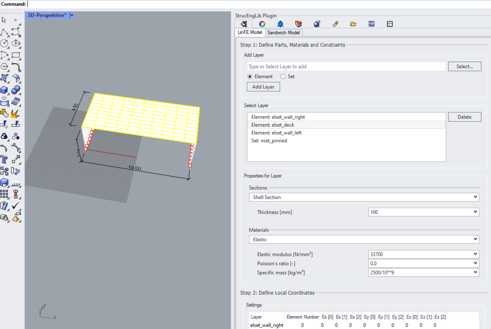

[](https://github.com/kfmResearch-NumericsTeam/StrucEng_Library_Plug_in/actions/workflows/distrib_sh_build.yml)
[](https://github.com/kfmResearch-NumericsTeam/StrucEng_Library_Plug_in/actions/workflows/codeql-analysis.yml)
[](https://www.codefactor.io/repository/github/kfmresearch-numericsteam/struceng_library_plug_in)
[](https://lgtm.com/projects/g/kfmResearch-NumericsTeam/StrucEng_Library_Plug_in/alerts/)
[](https://github.com/kfmResearch-NumericsTeam/StrucEng_Library_Plug_in/wiki)


# StrucEngLib Plugin
Rhinoceros 3D Plugin For StrucEng Library. The StrucEng Library includes mechanical models, saftey concepts, GUI's, load generator, etc. for the structural analysis reinforced concrete and masonry.

  
<p align="left">
    
</p>

### Installation
To install, search for "StrucEngLib" in Rhino's Package Store. Please consider
the [installation section in the
wiki](https://github.com/kfmResearch-NumericsTeam/StrucEng_Library_Plug_in/wiki/Installation)
for more detailed instructions.

### Build
The build setup is specified and reproducible with a linux based Vagrant image.
Please consider [./tools/vagrant](./tools/vagrant) for detailed build instructions. 
```
$ vagrant up
$ ./distrib_vagrant.sh help
distrib.sh: ./distrib.sh {update_version|version|build|package|deploy_test|deploy|distrib|distrib_test}
commands: 
  update_version <version>.....: updates version
  version......................: list version
  build........................: build dotnet solution
  test.........................: build dotnet solution, run tests
  package......................: builds solution, creates yak package format
  deploy_test..................: deploys the yak package found to test store
  deploy.......................: deploys the yak package found store
  distrib......................: builds, packages, deploys package to store
  distrib_test.................: builds, packages, deploys package to test store
```
### Files
```
./StrucEngLib/...........: .net C# Rhino Plugin
./StrucEngLibTest/.......: Tests
./tools/.................: Development tools
./tools/vagrant/.........: Vagrant documentation and scripts
./tools/distrib/.........: Build and distribution tools
./tools/distrib/assets...: Asset files for distribution, manifest
./tools/test/............: Unit test runner
```
